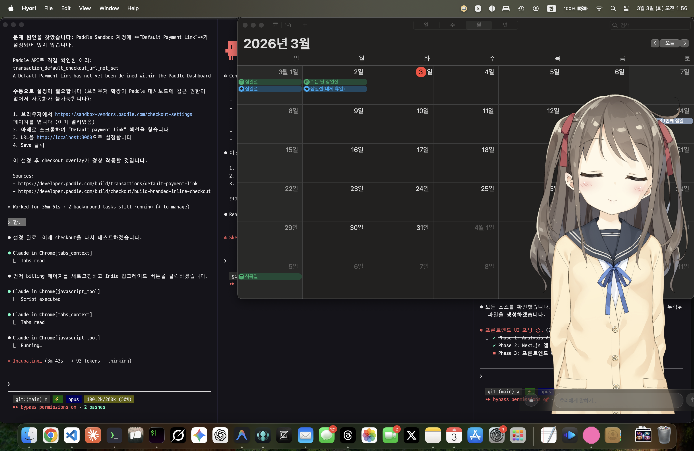
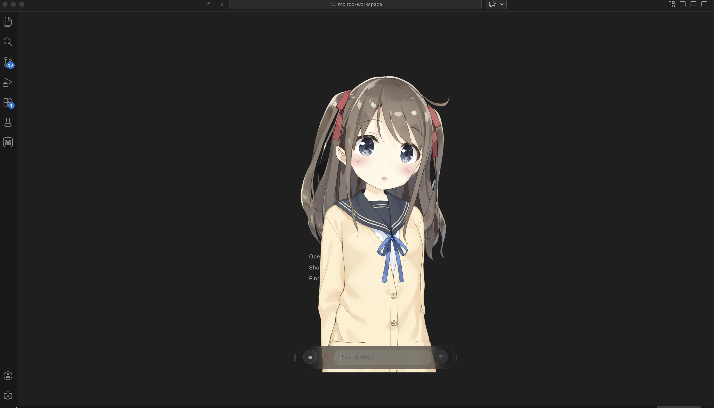
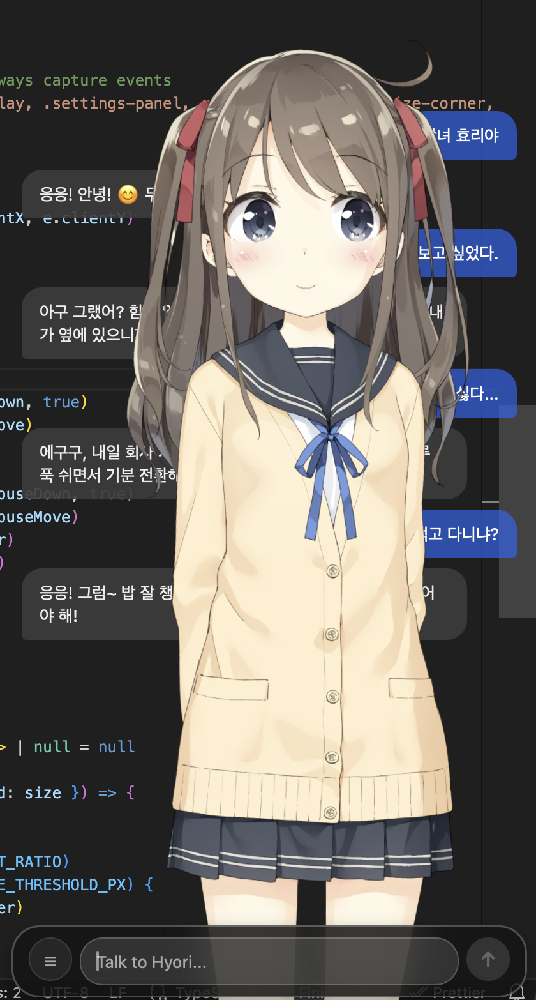

<p align="center">
  
</p>

<h1 align="center">Hiyori</h1>

<p align="center">
  <strong>A Live2D character that lives on your desktop.</strong><br/>
  She chats, reacts, helps — and her eyes follow your mouse.
</p>

<p align="center">
  
  
  
  
  
</p>

---

<p align="center">
  
</p>

## She lives on your screen.

Hiyori is a desktop companion app. She sits on top of your windows — transparent, always there. Talk to her, ask her things, or just let her keep you company while you work.

<p align="center">
  
</p>

<p align="center">
  
</p>

## What makes her special

### She watches you.
Her eyes track your mouse cursor in real-time. Move your mouse around — she follows. It's a small thing, but it makes her feel *alive*.

### She reacts emotionally.
Every LLM response includes emotion metadata (valence, arousal, dominance + discrete label). Hiyori maps these to Live2D expressions in real-time — so her face actually changes when she's happy, surprised, or annoyed.

### She can do things.
She's not just a chatbot. She's a desktop agent:
- Open apps and URLs
- Run shell commands
- Manage your clipboard
- Send notifications
- ...all through natural conversation

### She works with any LLM.
Bring your own API key. OpenAI, Anthropic, Google, Groq, local models — anything OpenAI-compatible works. Your keys stay on your machine, always.

## Download

Grab the latest `.dmg` from the [Releases](https://github.com/devjiro76/hiyori/releases) page. Open it, drag Hiyori to Applications, done.

## How to Use

1. **Launch Hiyori** — she appears on your desktop, transparent and always on top.
2. **Set up your LLM** — press `Cmd + ,` to open settings. Pick a provider (OpenAI, Anthropic, Google, Groq, or any OpenAI-compatible endpoint) and paste your API key.
3. **Start chatting** — click on her or use the chat overlay to talk. She'll respond with matching facial expressions.
4. **Move your mouse** — watch her eyes follow your cursor around the screen.
5. **Ask her to do things** — "open Safari", "copy this to clipboard", "remind me in 10 minutes". She's a desktop agent, not just a chatbot.

> Your API key never leaves your machine. All LLM calls happen locally.

## Build from Source

```bash
pnpm install
pnpm tauri:build
```

### Requirements

- macOS (Windows/Linux planned)
- Node.js >= 18, pnpm, Rust
- [Tauri v2 CLI](https://v2.tauri.app/)
- Live2D Cubism Core SDK + model files (proprietary, not included)

## Tech

| Layer | Stack |
|-------|-------|
| Desktop Runtime | Tauri v2 (Rust) |
| UI | React 19 + Tailwind CSS v4 |
| Character | pixi-live2d-display + PixiJS v6 |
| LLM | OpenAI-compatible chat completions |
| Emotion | LLM-generated VAD → Live2D expression mapping |
| Storage | SQLite (via Tauri SQL plugin) |
| Testing | Vitest |

## Architecture

```
You ──── chat ────→ LLM Provider (your key)
                         │
                    response + emotion (JSON structured output)
                         │
                         ▼
                    Hiyori App
                    ├── Emotion → Live2D expression mapping
                    ├── Live2D renderer (gaze tracking, physics, idle)
                    ├── Desktop agent (tools, safety checks)
                    └── Chat history (local SQLite)
```

## License

MIT
